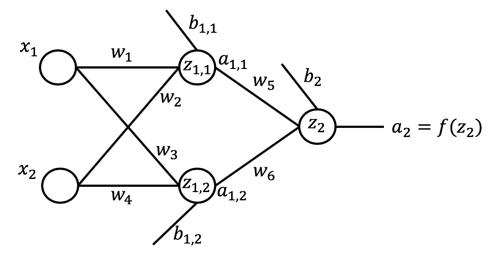

# Artificial Neural Networks ANNs

 

## Dependencies

## Introduction

The idea of ANNs is based on the belief that working of human brain by making the right connections, can be imitated using silicon and wires as living neurons and dendrites.

ANNs are composed of multiple `nodes`, which imitate biological neurons of human brain. The neurons are connected by links and they interact with each other. The nodes can take input data and perform simple operations on the data. The result of these operations is passed to other neurons. The output at each node is called its `activation` or `node value`.

Each link is associated with `weight`. ANNs are capable of learning, which takes place by altering weight values. The following illustration shows a simple ANN −

In the [Notebook](Notebook.ipynb), we'll see how to use numpy to implement ANNs. 

## Thanks for Reading :)