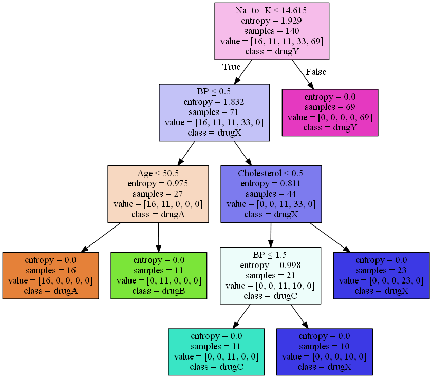

# Decision Trees

 

## Dependencies

## Introduction

A `decision tree` is a decision support tool that uses a tree-like model of decisions and their possible consequences, including chance event outcomes, resource costs, and utility. It is one way to display an algorithm that only contains conditional control statements.

Decision trees are commonly used in operations research, specifically in decision analysis, to help identify a strategy most likely to reach a goal, but are also a popular tool in machine learning.

In the [Notebook](Notebook.ipynb), we learn how to use scikit-learn to implement Decision trees. 

## Thanks for Reading :)