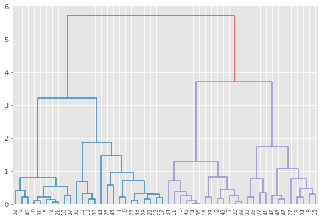

# Hierarchical Clustering

 

## Dependencies

## Introduction

In statistics, `hierarchical clustering` (also called hierarchical cluster analysis or HCA) is a method of cluster analysis which seeks to build a hierarchy of clusters. Strategies for hierarchical clustering generally fall into two types:

-Agglomerative: This is a "bottom-up" approach: each observation starts in its own cluster, and pairs of clusters are merged as one moves up the hierarchy.

-Divisive: This is a "top-down" approach: all observations start in one cluster, and splits are performed recursively as one moves down the hierarchy.

In general, the merges and splits are determined in a greedy manner. The results of hierarchical clustering are usually presented in a dendrogram.

In the [Notebook](Notebook.ipynb), we learn how to use scipy and scikit-learn to implement Agglomerative hierarchical clustering which is more popular than the Divisive one. 

## Thanks for Reading :)