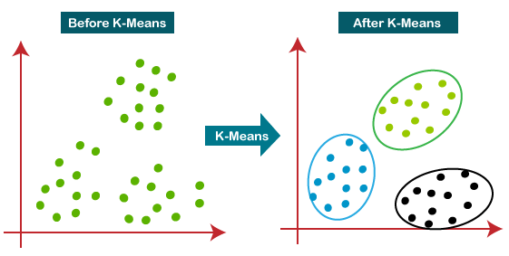

# K-means Clustering

 

## Dependencies

## Introduction

`K-Means Clustering` is an Unsupervised Learning algorithm, which groups the unlabeled dataset into different clusters. Here K defines the number of pre-defined clusters that need to be created in the process, as if K=2, there will be two clusters, and for K=3, there will be three clusters, and so on.

It is an iterative algorithm that divides the unlabeled dataset into k different clusters in such a way that each dataset belongs only one group that has similar properties. It allows us to cluster the data into different groups and a convenient way to discover the categories of groups in the unlabeled dataset on its own without the need for any training.

In the [Notebook](Notebook.ipynb), we learn how to use scikit-learn to implement K-means Clustering. 

## Thanks for Reading :)