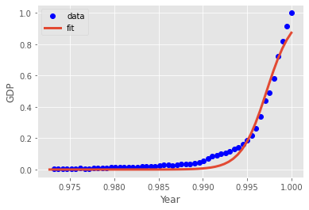

# Non Linear Regression

## Dependencies

## Introduction

In statistics, `non-linear regression` is a form of regression analysis in which observational data are modeled by a function which is a nonlinear combination of the model parameters and depends on one or more independent variables. The data are fitted by a method of successive approximations.

In the [Notebook](Notebook.ipynb), we learn how to use SciPy to implement non-linear regression. 

## Thanks for Reading :)
