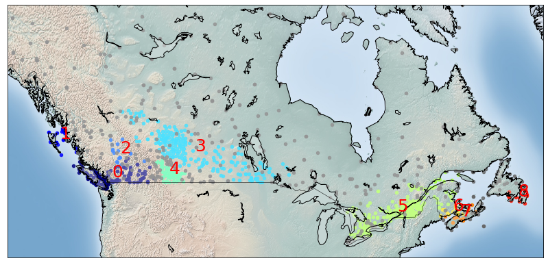

# Density-Based Spatial Clustering of Applications with Noise (DBSCAN)

 

## Dependencies

## Introduction

`Density-based spatial clustering of applications with noise (DBSCAN)` is a density-based clustering non-parametric algorithm: given a set of points in some space, it groups together points that are closely packed together (points with many nearby neighbors), marking as outliers points that lie alone in low-density regions (whose nearest neighbors are too far away). DBSCAN is one of the most common clustering algorithms and also most cited in scientific literature.

In the [Notebook](Notebook.ipynb), we learn how to use scikit-learn to implement DBSCAN. 

## Thanks for Reading :)