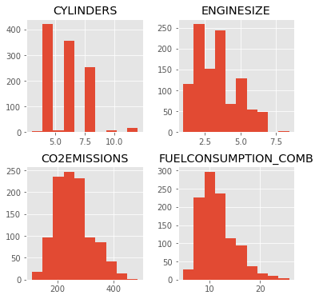

# Multiple Linear Regression

  

In statistics, linear regression is a linear approach to modelling the relationship between a scalar response and one or more explanatory variables (also known as dependent and independent variables). The case of one explanatory variable is called simple linear regression; for more than one, the process is called `multiple linear regression`. This term is distinct from `multivariate linear regression`, where multiple correlated dependent variables are predicted, rather than a single scalar variable.

In this [Notebook](Notebook.ipynb), we learn how to use scikit-learn to implement multiple linear regression. 

## Thanks for Reading :)