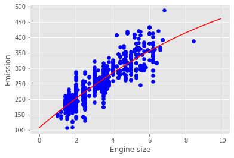

# Polynomial Regression

  

Sometimes, the trend of data is not really linear, and looks curvy. In this case we can use `Polynomial regression` methods. In fact, many different regressions exist that can be used to fit whatever the dataset looks like, such as quadratic, cubic, and so on, and it can go on and on to infinite degrees.

In essence, we can call all of these, polynomial regression, where the relationship between the independent variable x and the dependent variable y is modeled as an nth degree polynomial in x. Lets say you want to have a polynomial regression (let's make 2 degree polynomial):

$y = b + \theta_1  x + \theta_2 x^2$

In this [Notebook](Notebook.ipynb), we learn how to use scikit-learn to implement polynomial regression. 

## Thanks for Reading :)