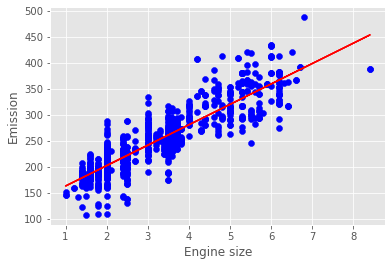

# Simple Linear Regression

  

In statistics, `simple linear regression` is a linear regression model with a single explanatory variable. That is, it concerns two-dimensional sample points with one independent variable and one dependent variable (conventionally, the x and y coordinates in a Cartesian coordinate system) and finds a linear function (a non-vertical straight line) that, as accurately as possible, predicts the dependent variable values as a function of the independent variable. The adjective simple refers to the fact that the outcome variable is related to a single predictor.

In this [Notebook](Notebook.ipynb), we learn how to use scikit-learn to implement simple linear regression. 

## Thanks for Reading :)